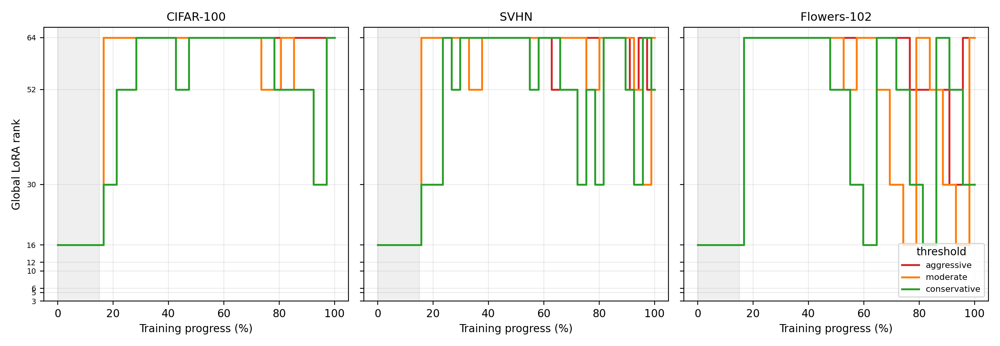
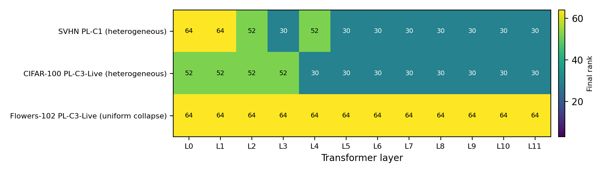

# Curvature-Guided Rank Scheduling (CGRS) for LoRA Fine-Tuning of Vision Transformers

Code, logs, and result files for **CGRS**, a family of schedulers that change LoRA rank *during* fine-tuning using a diagonal empirical-Fisher curvature signal. Experiments use an ImageNet-pretrained ViT-Base/16 on CIFAR-100, SVHN, and Oxford Flowers-102.

> This repository accompanies a paper under double-blind review. It was originally named "...Rank-Selection..."; the method is now called **Rank Scheduling**.

**Status: pilot study.** Every configuration is a single seed (42). Differences of 0.5–1.5 points may be within run-to-run noise. See [Limitations and implementation notes](#limitations-and-implementation-notes).

---

## Contents
1. [Idea](#idea)
2. [Headline results](#headline-results)
3. [Method in detail](#method-in-detail)
4. [Experimental setup](#experimental-setup)
5. [Full results](#full-results)
6. [Repository structure](#repository-structure)
7. [Environment and running](#environment-and-running)
8. [Result file formats](#result-file-formats)
9. [Limitations and implementation notes](#limitations-and-implementation-notes)

---

## Idea

LoRA fixes its rank `r` before training and shares it across layers. CGRS treats rank as a training-time variable. It probes the diagonal empirical Fisher of the LoRA parameters (squared mini-batch gradients), summarizes it globally or per transformer block, and compares it with calibrated thresholds:

- **Global CGRS** uses one shared rank that can grow *and* shrink along a discrete ladder.
- **Layer-wise CGRS** assigns one rank to each of the 12 blocks (query and value share it) and can only *grow*.
- Every rank change carries over the learned low-rank update.

---

## Headline results

Test accuracy (%), ViT-Base/16, single seed.

| Dataset | Global CGRS (best) | Fixed LoRA, same final rank | Δ | Best AdaLoRA | Full FT | Frozen backbone (trained head) |
|---|---|---|---|---|---|---|
| CIFAR-100 | **91.16** (τ=75th pct, final r=64) | 90.46 | +0.70 | 90.06 | 92.55 | 86.34 |
| SVHN | **97.45** (τ=75th pct, final r=52) | 96.98 | +0.47 | 95.91 | 97.77 | 55.06 |
| Flowers-102 | 98.52 (τ=25th pct, final r=64) | 98.73 | −0.21 | **98.78** | 99.01 | 99.20 |

- CIFAR-100 and SVHN: global CGRS beats fixed LoRA at the same final rank and the best AdaLoRA run.
- Flowers-102 reverses the pattern. AdaLoRA wins, and some layer-wise schedules collapse to the maximum rank (a threshold-calibration failure).
- "Best" CGRS and AdaLoRA runs were chosen by test accuracy among 3 configurations each.

---

## Method in detail

### 1. LoRA parameterization
For a frozen projection `W0 ∈ R^{d_out×d_in}`:

`h = W0·x + (α/r)·B·A·x`, with `A ∈ R^{r×d_in}`, `B ∈ R^{d_out×r}`.

LoRA is applied to the **query and value** projections of all 12 ViT blocks (24 adapters, `d_in = d_out = 768`). A uniform rank uses `24·(768+768)·r = 36,864·r` adapter parameters. `α = 16`, dropout 0.1, bias none.

### 2. Diagonal empirical-Fisher curvature score
For probe mini-batches `b` with gradient `g_b = ∇θ ℓ_b`, the estimator is `f̂ = mean_b (g_b ⊙ g_b)`. The scheduler uses:

- **Module/block score** `λ_m = max_i f̂_i` over the coordinates of the adapter(s).
- **Global score** `λ = max` over all trainable LoRA coordinates.
- The trace `Σ f̂_i` is recorded for diagnostics only.

Details:
- Gradients are mini-batch-mean-loss gradients, not per-sample. The model is in `eval()` mode while probing.
- Static profiling uses batches of size 4. In-training probes use training batches of size 16.

### 3. Threshold calibration (Phases 2 and 4)
- **Static (Phase 2):** Train fixed-rank LoRA at all 14 ranks. For each checkpoint, compute `λ` globally and per `(block, q/v)` over 64 probe batches of size 4 (256 samples). The 24 per-module scores at `r = 16` give the **25th / 50th / 75th percentiles**, used as the *aggressive / moderate / conservative* thresholds `τ`.
- **Live (Phase 4, PL-C3-Live):** Train a fresh `r = 30` model for 800 warm-up steps (same seed), measure per-module `λ` over 16 probe batches, multiply by a ×4 safety factor, and later multiply by 0.5 (net ×2). A block's threshold is the larger of its query and value values.

### 4. Global scheduler
- Rank ladder `R = {3, 5, 6, 10, 12, 16, 30, 52, 64}`, initial `r = 16`.
- Probes every **200** steps, after a **15% grace period**, and no earlier than **400 steps** after the previous change. Each probe uses 8 batches.
- If `λ > τ`, move up `max(1, floor(λ/τ))` rungs (capped at the top). If `λ < 0.3τ`, move down one rung. Otherwise keep the rank.
- After a resize the learning rate is multiplied by `r_new / r_old`, the AdamW optimizer is rebuilt (state reset), and a new cosine schedule runs over the remaining steps.

### 5. Layer-wise schedulers
All start every block at `r = 30`, bounded to `[3, 64]`, with probes every 200 steps (16 batches) and growth only. In the CIFAR-100 implementation there is no grace period. After a block changes, a 200-step counter is set. It is decremented at each check, so the effective gap between changes of one block is 400 steps. Resizing a block resets only the Adam state of its two adapters. The learning-rate schedule is not changed.

| Policy | Rule |
|---|---|
| **PL-C1** | Block score (max of q/v `λ`) is compared with one shared static threshold: the median (50th pct) of Phase 2 `r=16` scores. |
| **PL-C3-Live** | Each block gets its own threshold from the live calibration. |
| **Ordinal-K4 / K5** | At each check, rank the 12 blocks by `λ` and grow the top 4 (or 5). Jump size is `floor(score / median score)` rungs (minimum 1). Blocks 4–7 have a hand-chosen minimum rank of 16 (note: starting rank is 30, so this floor never binds in this configuration). |

For threshold policies, the jump size is `max(1, floor(λ_block / τ_block))` rungs, capped at the top rung (rank 64).

### 6. Rank transfer
- **Shrink:** form `ΔW = B·A`, take a truncated SVD, and set `B' = U_r·√Σ_r`, `A' = √Σ_r·V_rᵀ`. This is the best rank-`r'` approximation in Frobenius norm.
- **Grow:** the existing `A` and `B` are copied into the larger matrices and the added rows/columns are **zero-padded**.
- The scaling `α/r` is updated to the new rank, so the scaled update `(α/r)·B·A` is not exactly preserved across a resize.

---

## Experimental setup

| | |
|---|---|
| Backbone | `google/vit-base-patch16-224` (Hugging Face) |
| Preprocessing | Resize to 224×224, ToTensor, normalize with the ViT image processor mean/std. **No augmentation.** |
| Optimizer | AdamW, weight decay 0.01, batch size 16, cosine decay (stepped per iteration), gradient clipping at 1.0 |
| Learning rates | Full FT 5e-5, frozen backbone + head 1e-3, LoRA-family (fixed, CGRS, AdaLoRA) 5e-4 |
| LoRA | targets `query`, `value`; α = 16; dropout 0.1; bias none |
| Seed | 42 (Python, NumPy, PyTorch, CUDA). `cudnn.benchmark = True`, so runs are not bit-reproducible. |
| Hardware | NVIDIA A100 and V100 GPUs, used interchangeably across runs (no single GPU throughout) |

| Dataset | Train / Val / Test | Epochs | Steps |
|---|---|---|---|
| CIFAR-100 | 45,000 / 5,000 / 10,000 (seeded random split of the train set) | 3 | 8,439 |
| SVHN | 68,000 / 5,257 / 26,032 (`train` split only; no `extra`) | 3 | 12,750 |
| Oxford Flowers-102 | 1,840 / 200 / 6,149 (official train+val concatenated, then seeded re-split; test untouched) | 20 | 2,300 |

**Flowers-102:** with only 2,300 steps, check interval and cooldown are given as fractions of training: 2.4% (~55 steps) and 4.7% (~108 steps). The 15% grace period still applies.

**Baselines:**
- Full fine-tuning.
- Frozen backbone with a trained classifier head.
- Fixed LoRA at `r ∈ {3, 5, 6, 10, 12, 16, 30, 52, 64, 80, 100, 128, 150, 200}`.
- AdaLoRA (Hugging Face PEFT 0.10.0) with target ranks 16, 32, 64, initial rank `int(1.5 × target)`, `tinit` = `tfinal` = 15% of total steps, `deltaT` = 2.4% of total steps, same optimizer, LR, and schedule as the other LoRA runs. `update_and_allocate(step)` runs after every optimizer step.

**Experimental phases** (in `CGRS_CIFAR100_Rebuild_AllPhases.py`):
1. Baselines and the 14-rank fixed LoRA sweep (checkpoints saved).
2. Curvature profiling of every Phase 1 checkpoint, giving percentile thresholds.
3. Global CGRS at three thresholds (aggressive, moderate, conservative).
4. Layer-wise CGRS: PL-C1, PL-C3-Live, Ordinal-K4, Ordinal-K5, plus rank–curvature correlation analysis (Pearson and Spearman, against both static and live curvature).

---

## Full results

### Fixed-rank LoRA sweep (test acc. %)

| Rank | Params (M) | CIFAR-100 | SVHN | Flowers-102 |
|---|---|---|---|---|
| 3 | 0.111 | 85.07 | 96.43 | 95.56 |
| 5 | 0.184 | 87.13 | 96.90 | 96.80 |
| 6 | 0.221 | 87.50 | 96.80 | 96.57 |
| 10 | 0.369 | 89.36 | 96.57 | 98.00 |
| 12 | 0.442 | 89.15 | 96.75 | 98.41 |
| 16 | 0.590 | 89.74 | 96.58 | 98.15 |
| 30 | 1.106 | 90.03 | 96.48 | 98.03 |
| 52 | 1.917 | 90.54 | 96.98 | 98.24 |
| 64 | 2.359 | 90.46 | 96.83 | 98.73 |
| 80 | 2.949 | 90.54 | 96.75 | 98.70 |
| 100 | 3.686 | 90.40 | 96.63 | 98.86 |
| 128 | 4.719 | 91.07 | 96.98 | 98.89 |
| 150 | 5.530 | 90.70 | 96.88 | 98.75 |
| 200 | 7.373 | 90.62 | 96.80 | 98.54 |

### Conventional baselines

| Dataset | Full FT (params; acc.) | Frozen backbone (params; acc.) |
|---|---|---|
| CIFAR-100 | 85,875,556; 92.55 | 76,900; 86.34 |
| SVHN | 85,806,346; 97.77 | 7,690; 55.06 |
| Flowers-102 | 85,877,094; 99.01 | 78,438; 99.20 |

### All global CGRS runs

| Dataset | Threshold | Final r | Rank changes | Params (M) | Acc. |
|---|---|---|---|---|---|
| CIFAR-100 | 25th | 64 | 1 | 2.359 | 90.72 |
| CIFAR-100 | 50th | 64 | 6 | 2.359 | 90.62 |
| CIFAR-100 | 75th | 64 | 8 | 2.359 | **91.16** |
| SVHN | 25th | 52 | – | 1.917 | 97.03 |
| SVHN | 50th | 64 | – | 2.359 | 97.21 |
| SVHN | 75th | 52 | – | 1.917 | **97.45** |
| Flowers-102 | 25th | 64 | – | 2.359 | **98.52** |
| Flowers-102 | 50th | 64 | – | 2.359 | 98.28 |
| Flowers-102 | 75th | 30 | – | 1.106 | 97.01 |

On Flowers-102, curvature values are about 1e-5 to 1e-4 and the global scheduler oscillates, for example 16→64→52→30→16→64 in one conservative run.

### Layer-wise CGRS

| Dataset | Scheduler | Avg. rank | Params (M) | Acc. | Final ranks |
|---|---|---|---|---|---|
| CIFAR-100 | PL-C1 | 45.83 | 1.690 | 89.13 | heterogeneous |
| CIFAR-100 | PL-C3-Live | 37.33 | 1.376 | **90.18** | heterogeneous |
| CIFAR-100 | Ordinal-K4 | 61.00 | 2.249 | 88.68 | heterogeneous |
| CIFAR-100 | Ordinal-K5 | 63.00 | 2.322 | 88.66 | heterogeneous |
| SVHN | PL-C1 | 39.33 | 1.450 | 96.55 | heterogeneous |
| SVHN | PL-C3-Live | 62.00 | 2.286 | **96.75** | heterogeneous |
| SVHN | Ordinal-K4 | 60.00 | 2.212 | 96.72 | heterogeneous |
| SVHN | Ordinal-K5 | 64.00 | 2.359 | 96.72 | uniform |
| Flowers-102 | PL-C1 | 63.00 | 2.322 | 97.92 | heterogeneous |
| Flowers-102 | PL-C3-Live | 64.00 | 2.359 | **98.26** | uniform |
| Flowers-102 | Ordinal-K4 | 63.00 | 2.322 | 98.23 | heterogeneous |
| Flowers-102 | Ordinal-K5 | 63.00 | 2.322 | 98.11 | heterogeneous |

- PL-C3-Live on CIFAR-100 uses 42% fewer final adapter parameters than fixed `r = 64`, at 0.28 points lower accuracy.
- SVHN accuracy is nearly flat across ranks (96.43–96.98 for r = 3–200), so low allocations stay competitive.
- On Flowers-102, layer-wise methods converge to ranks of 63–64 (PL-C3-Live is uniformly 64). That is an allocation failure, not evidence every block needs maximum rank.

### AdaLoRA (PEFT)

| Dataset | Target r | Stored params (M) | Acc. |
|---|---|---|---|
| CIFAR-100 | 16 / 32 / 64 | 0.885 / 1.771 / 3.541 | 89.25 / 89.71 / 90.06 |
| SVHN | 16 / 32 / 64 | 0.885 / 1.771 / 3.541 | 95.91 / 95.74 / 95.86 |
| Flowers-102 | 16 / 32 / 64 | 0.885 / 1.771 / 3.541 | 98.55 / 98.78 / 98.60 |

AdaLoRA's stored parameters reflect its over-parameterized initialization (init rank = 1.5 × target, including its per-triplet singular values), so rank-matched comparisons are not parameter-matched.

### Does curvature drive allocation?
Final block ranks were correlated with static (`r=16`) and live curvature (Pearson and Spearman, 24 adapter points). The clearest case is SVHN PL-C1 vs. static curvature (Pearson r = 0.4325, p = 0.0348). Other non-uniform runs are mostly positive but not significant (p ≥ 0.05). Because q/v share a rank, points are paired, so these are descriptive. Uniform runs make correlation undefined.

---

## Repository structure
